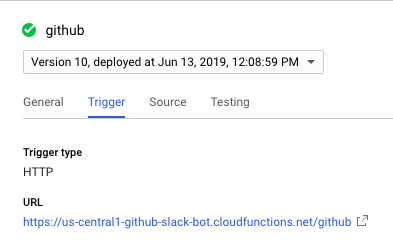
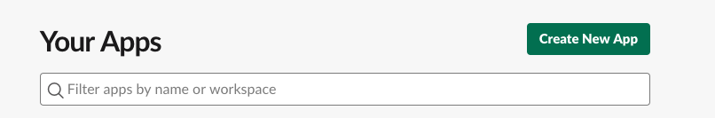
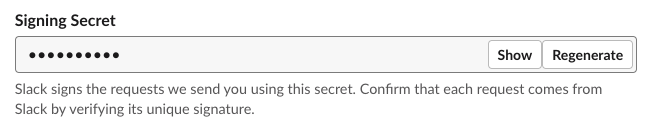
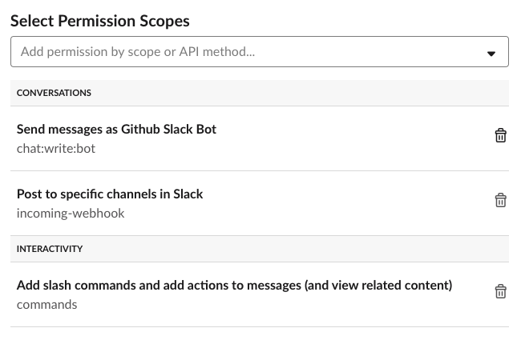
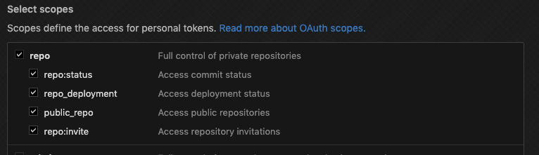

# Slack Bot for Github

[](https://lgtm.com/projects/g/jfairley/github-slack-bot/alerts/)
[](https://lgtm.com/projects/g/jfairley/github-slack-bot/context:javascript)
[](https://www.codefactor.io/repository/github/jfairley/github-slack-bot)
[](https://circleci.com/gh/jfairley/github-slack-bot)
[](https://github.com/semantic-release/semantic-release)
[](https://gitter.im/github-slack-bot/Lobby)

## Introduction

This represents an alternative to the [official GitHub app](https://slack.com/apps/A8GBNUWU8-github) offered in the Slack marketplace. Basically, it listens for activity in your GitHub organization and notifies you in Slack when activity is relevant to _you_ based on criteria which is defined by _you_.

This app is set up to be hosted within [Google Cloud Functions](https://cloud.google.com/functions). You'll need to host it yourself, but don't worry, my experience is that this easily stays within the free tier.

### Why?

Basically, I'm annoyed by the default Github application. If your team is not tiny, it's quite spammy. It'll tell you all activity for a repo, which is more than I'm interested in. The main directive for this app is to only receive notifications when I'm tagged or when there's activity on issues _I_ opened.

### Why Not Publicly Hosted?

I would love to host this bad boy in a single place and add it to the Slack marketplace, but I expect that would bump me out of the free tier, and I'm not interested in figuring out how to raise money.

### A Note About Code Starts

This is hosted as a Google Cloud Function, which will go into cold storage when not active. In the morning, for instance, you may experience a laggy response upon first use. This is a cold start problem.

#### Work-Around?

Kinda. Configure a Google Cloud Scheduler to ping your function every so often. It's not fool-proof, because Google will ice a function after various amounts of time based on overall system load, but it's a try.

https://cloud.google.com/scheduler/ 

## Setup and Runtime

As mentioned, this is self-hosted, so there's more to it than the `Install App` button you'd see from the Slack marketplace. I'll walk you through the setup.

By the way, you'll need to be a Google Cloud, Slack, and GitHub administrator for this stuff. If you're not that, go find one.

### Google Cloud Functions

First things first, let's set up a home for our functions. We'll start by simply creating the functions. We won't push code to them until later.

1. Navigate to your Google Cloud console.
    - https://console.cloud.google.com/
1. If you haven't already, create a project for this app.
    - https://cloud.google.com/resource-manager/docs/creating-managing-projects
1. Navigate to the Cloud Functions.
    - https://console.cloud.google.com/functions
1. Create two functions; one for github outbound traffic and another for slack.
    - Slack
      - Click `CREATE FUNCTION`.
      - `Name`: `slack`
      - `Trigger`: `HTTP`
      - `Runtime`: `Node.js 8`
      - Click `Create`
    - Github
      - Click `CREATE FUNCTION`.
      - `Name`: `github`
      - `Trigger`: `HTTP`
      - `Runtime`: `Node.js 8`
      - Click `Create`
1. For **both functions**, open it by clicking the name, switch to the `Trigger` tab, and copy the `URL`.
    - We'll feed these URLs into the Slack app.
    - 
    - ** This is a screenshot of my sandbox app. Your URL will be different. 

### Slack App

Since I haven't deployed _my_ app into the marketplace, you'll need to create your own app, which you can install into your slack instance.

#### Create an App

1. Navigate to https://api.slack.com/apps.
1. Click `Create New App`.
    - 
1. Give your app a name and select a workspace.
    - The name doesn't really matter, because I don't expect you'll be distributing this.
1. Under `Basic Information > App Credentials`, copy the `Signing Secret`. You'll use this as the value of `SLACK_SIGNING_SECRET`.
    - 
   
#### Add Features!

Turn on the following features for your app:

- Incoming Webhooks
    - Just turn it on.
    - TODO: try turning it off.
- Interactive Components
    - Under `Request URL` is where you'll register the hook URL for your cloud function. Insert the **slack** function URL copied from earlier.
- Slash Commands
    - Click `Create New Command`.
    - `Command`: `/github`
      - You might choose something different. This is _your_ slack account after all.
    - `Request URL`: Insert the **slack** function URL copied from earlier.
      - Yes, this the same URL used for `Interactive Components`.
    - Add a `Short Description`.
    - Add a `Usage Hint`. I recommend `help`.
    - Click `Save`.
- Permissions
    - Ensure the following permissions are enabled.
    - 

#### Install Your App

1. Under `Install App`, install your app.
1. Once installed, copy the `OAuth Access Token`, which will be used for `SLACK_ACCESS_TOKEN`;

### GitHub

You'll need to configure webhooks and set up an access token for github api communication.

#### Webhooks

1. Crack open your organization settings in github.
    - NOTE: This URL will be different for each org.
    - https://github.com/organizations/<my-org>/settings/hooks
1. Click `Add Webhook`.
1. `Payload URL`: Insert the **github** function URL copied from earlier.
1. `Content type`: `application/json`
1. `Secret`: Anything you want. Apply this to the `GITHUB_WEBHOOK_SECRET` environment.
1. Select `Let me select individual events`
    - `Commit comments`
    - `Issues`
    - `Issue comments` 
    - `Pull requests` 
    - `Pull request reviews` 
    - `Pull request review comments` 
    - `Statuses`

#### Personal Access Token

1. Create one!
    - https://github.com/settings/tokens
1. Enable some scopes for this webhook.
    - 
1. Save and copy the token for the `GITHUB_TOKEN` environment.

### Local

Fill out all of your environment variables and deploy the functions!

#### .env.yml

Place the following environment variables in a `.env.yml` file at the root of your repo. 

| Variables               | Description                | More Information                                         |
|-------------------------|----------------------------|----------------------------------------------------------|
| `GITHUB_ORG`            | github organization        |                                                          |
| `GITHUB_TOKEN`          | github webhook token       | https://developer.github.com/webhooks/                   |
| `GITHUB_WEBHOOK_SECRET` | github webhook secret      | https://developer.github.com/webhooks/                   |
| `SLACK_ACCESS_TOKEN`    | token from your slack app  | https://api.slack.com/bot-users                          |
| `SLACK_SIGNING_SECRET`  | slack api verification     | https://api.slack.com/docs/verifying-requests-from-slack |

#### Deploy

- Install the Google Cloud SDK.
    - https://cloud.google.com/sdk/
- Connect to your project.
- Run the following npm commands to push code.

```
npm install
npm run deploy:github
npm run deploy:slack
```

### Try It!

You should be able to trigger `/github help` and see a response.

## Develop

install dependencies

```bash
npm install
```

lint and format

```bash
npm run lint
```
